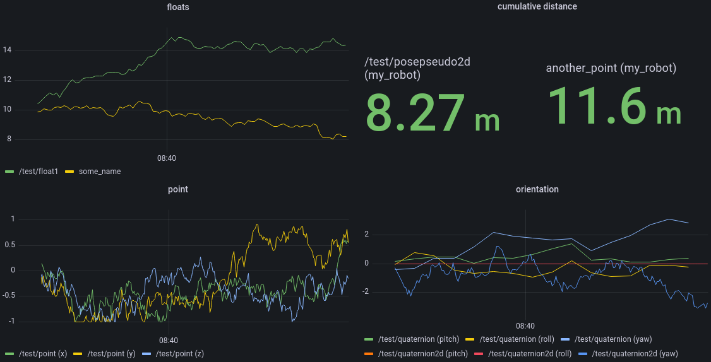

# influxdb_monitoring

This ROS package tries to provide a monitoring solution for ROS Noetic. It provides monitoring of message content, topic frequencies and node status.

## Description

ROS messages, as well as topic frequences are monitored and written to an InfluxDB2 instance, defined with an `url`, `bucket`, `organization` and authenticated with a `token`. A docker compose file is provided to create a local instance. Grafana can be used to create dashboards to easily investigate and analyze ROS behaviors.

ROS nodes can be monitored, their state written to the database, and restarted if they failed.

After [installation](#installation) of dependencies start the given [docker compose file](docker/docker-compose.yml) with
```
rosrun influxdb_monitoring start_docker.sh
```
then message monitoring is started (with some pseudo publishers) with
```
roslaunch influxdb_monitoring message_example.launch
```


Grafana dashboards visualizing the example message data are given in [`docker/grafana_example`](docker/grafana_example), more screenshots are [here](docker/grafana_example/images). These can be imported in the grafana GUI.


## Installation
Python dependencies are given in the package, they can be installed with
```
rosdep install --from-paths src --ignore-src -r -y
```
when located in the workspace folder.

If the docker-compose file should be used to create a local TIG stack (Telegraf, InfluxDB and Grafana), docker (with compose plugin) has to be [installed](https://docs.docker.com/engine/install/ubuntu/#install-using-the-repository). Possibly also set the log file specifications as suggested in [`docker/set_docker_logsize.txt`](docker/set_docker_logsize.txt) (and restart docker afterwards `sudo systemctl restart docker`).

In my case the VSCode autocompletion did not work, i had to copy the module to `workspace_dir/devel/lib/python3/dist-packages/influxdb_monitoring`.
This is automated with [this](scripts/copy_module_to_devel.sh) script. 

**IMPORTANT: If the files are copied to `devel`, they have to be kept up to date, as they are used instead of possible changes in the `src` folder. It is always possible to just remove them from `devel`.**

## Usage
The follwing examples for usage are in folder `scripts`:

```
msgs_to_influxdb_basic.py
node_status_to_influxdb.py
node_monitor_watcher.py
topic_frequency_to_influxdb_basic.py
msgs_to_influxdb_high_frequency.py
topic_frequency_to_influxdb_high_frequency.py
```

Configuration of the InfluxDB is done with the following functions:
```python
# define the robot name
module.setRobotName("my_robot")

# all three methods are possible to specify the influxdb settings:
module.setConfig(token="MYTOKEN564651CAFG52AST6FS", org="myOrg", url="http://127.0.0.1:8086", bucket="webdata")
module.setConfig(filename=rospkg.RosPack().get_path("influxdb_monitoring") + "/config/influxdb_example.json")
module.setConfig(docker_compose_filename=rospkg.RosPack().get_path("influxdb_monitoring") + "/docker/docker-compose.yml")
```
It is possible to specify the InfluxDB config directly, as a JSON file or get it from a docker compose file. rospkg can be used to resolve package name to a total path.


### ROS messages
The module [`MessageMonitor`](include/influxdb_monitoring/MessageMonitor.py) provides functions to monitor the most common message types, containing messages from `geometry_msgs`, `std_msgs` and `sensor_msgs`.

For every message to monitor the ROS topic and message type has to be specified. It is possible to specify how often updates should be written to the database (`update_period`) or if changes in the message data should be written immediately (`on_change`).

Additional parameters are defined in the [docstring ](include/influxdb_monitoring/MessageMonitor.py) of each function.

The following script [`msgs_to_influxdb_basic.py`](scripts/msgs_to_influxdb_basic.py) shows an example for monitoring multiple common ROS messages. The example (including message publishers) can be started with 
```
roslaunch influxdb_monitoring message_example.launch
```

This script also includes an example of how to monitor a custom message not yet provided by the library. It is possible to tailor the stored metrics to your needs. E.g. the max/min ranges of the laser scan, as well as their angular orientation are saved to the database.

### ROS ropic frequency
[`TopicMonitor`](include/influxdb_monitoring/TopicMonitor.py) provides monitoring of ROS topics. 
It takes a list of `TopicEntry` and a monitoring frequency. The `TopicEntry` requires a topic name and optionally a window size for the rostopic.ROSTopicHz object. The window size can be derived from the expected frequency of the message by providing an estimated frequency.

The file [`topic_frequency_to_influxdb_basic.py`](scripts/topic_frequency_to_influxdb_basic.py) shows an example configuration, an example is launched with
```
roslaunch influxdb_monitoring topic_example.launch
```
Each entry is given as a `TopicEntry`, specifying the `topic_name` as well as an estimate of the published frequency to determine the window size.

### ROS nodes
[`NodeMonitor`](include/influxdb_monitoring/NodeMonitor.py) can monitor specified ROS nodes and restarts them. This requires `byobu` for multiwindow terminal operation. The configuration is given in a `.json` file (example [`node_config_example.json`](config/node_config_example.json)), specifying the nodes to monitor and in which `byobu` window they recide, as well as the (re-)start command of each window (window specification is given in `.json.sh`, has to have the same filename + `.sh`, see [`node_config_example.json.sh`](config/node_config_example.json.sh).

The whole stack can then be started with [`start_by_json.py`](scripts/start_by_json.py) loading the specified config file. See [`start_monitoring_example.sh`](scripts/start_monitoring_example.sh).


The node `node_status_to_influxdb.py` watches all specified nodes, and restarts them, `node_monitor_watcher.py` watches the node monitor (and restarts it in case it would crash). These nodes have to be loaded in the configuration and have to be monitored for full functionality (see [`node_config_example.json`](config/node_config_example.json) again).

The example can be started with
```
rosrun influxdb_monitoring start_monitoring_example.sh
```
containing node monitoring as well as topic and message monitoring.

If only monitoring is required without restarting the nodes, `restart_failed=True` can be used. This allows a simplified config file, without specifying windows and (re-)start commands, see [this config](config/node_config_example_just_monitoring.json). 
### CPU usage
The following CPU utilization was reported on a Ryzen 5 5600X.
| Example| | CPU | core|
|-------|-:|----:|----:|
| [topic_frequency](scripts/topic_frequency_to_influxdb_high_frequency.py)| 200 Float64 @ 200Hz | 11% | 140%|
| [publisher](scripts/pseudo_publisher_high_frequency.py) | 200 Float64 @ 200Hz | 9% | 110%|
| [topic_frequency](scripts/topic_frequency_to_influxdb_high_frequency.py) | 500 Float64 @ 50Hz  |  9% | 110%|
| [publisher](scripts/pseudo_publisher_high_frequency.py) | 500 Float64 @ 50Hz | 8% | 94%|
| [messages](scripts/msgs_to_influxdb_high_frequency.py) | 150 Float64 @ 100Hz                   |  4% | 55%|
| TODO: large messages | | ? | ? |

## Roadmap

- Test the current implementation for real robots, see what can be done to improve it further.
- Switch to batch writing for InfluxDB updates, this could improve performance for large deployments.
- Check CPU usage and performance for large messages (e.g. pointclouds or images)
- Extend message library to more types (open for suggestions of important message types!)
